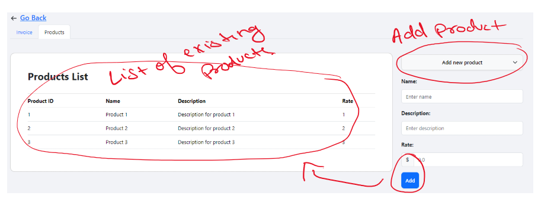
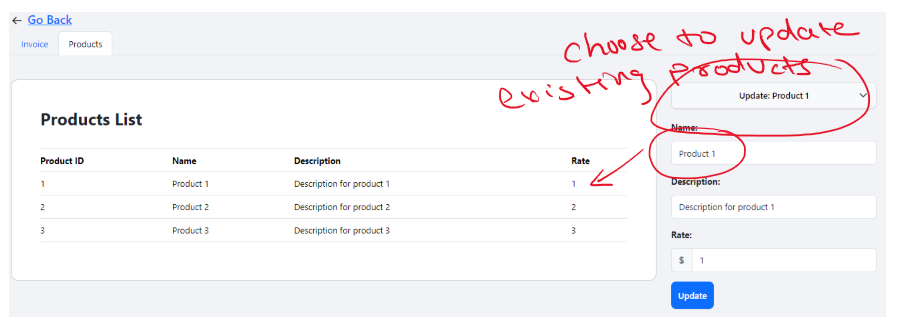
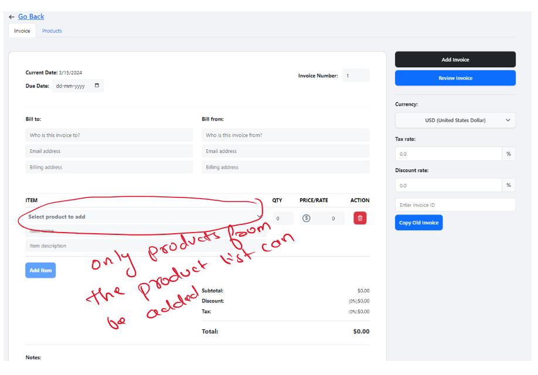
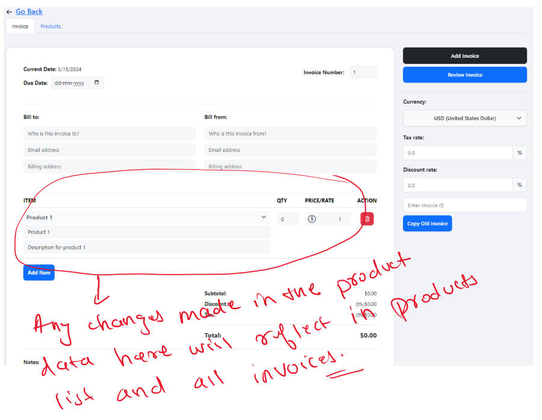

# swipe-assignment-frontend

- Deployed at:
  [https://swipe-assignment-frontend.qwertyvipul.io/](https://swipe-assignment-frontend.qwertyvipul.io/)
- View changes at:
  [https://github.com/qwertyvipul/swipe-assignment-frontend/commit/160821e35e3f6a9acd40b8010915daaf0b68b25d](https://github.com/qwertyvipul/swipe-assignment-frontend/commit/160821e35e3f6a9acd40b8010915daaf0b68b25d)

## Quick summary of work done

1. Have implemented the products tab and all related features as per the
   requirement.
2. Have skipped grouping feature due to time constraints.
3. Have written clean, well-documented and modular code for the new features.
4. All other already existing features works as previous and I have tried my
   best to limit the changes made in the existing codebase to minimal.

## Requirements checklist

- [x] Implement a Products Tab:
  - [x] When creating an invoice, ensure all associated products are displayed
        in a new 'Products' tab using Redux.
  - [x] The tab should allow users to modify product information, and these
        changes should be reflected in all associated invoices.
- [x] Dynamic Product Information Update:
  - [x] If a product already used in previous invoices is edited, the updated
        details should reflect both in the 'Products' tab and in all existing
        invoices where it's used.
  - [x] If a product is added to a new invoice with different values than the
        already stored values, update its details in the products tab and all
        invoices where it appears.
- [x] Implement validation for any changes made in the products tab. Ensure the
      Redux store is updated accordingly to maintain application state
      consistency
- [x] Design the new products tab and invoice creation interface to be intuitive
      and clear, highlighting available user actions.
- [ ] Grouping of Products in Invoice Creation
- [x] The application should properly handle any errors during invoice creation
      and provide appropriate feedback to the user.
- [x] Maintain clean, well-documented, and modular code for the new feature in
      line with existing standards.

## Screenshots

### Products tab

#### Add Product

#### Update product

### Invoice tab

#### Add products to invoice

#### Update product data from invoice

